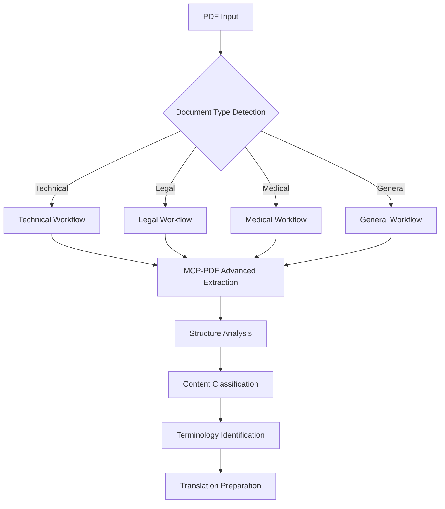
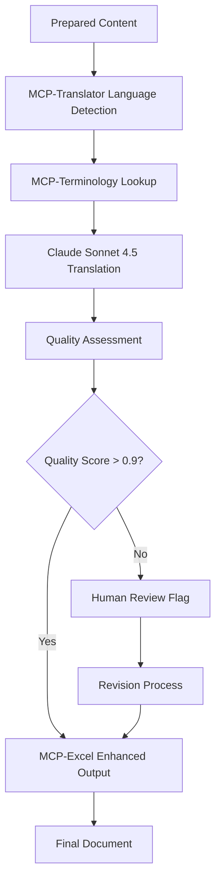
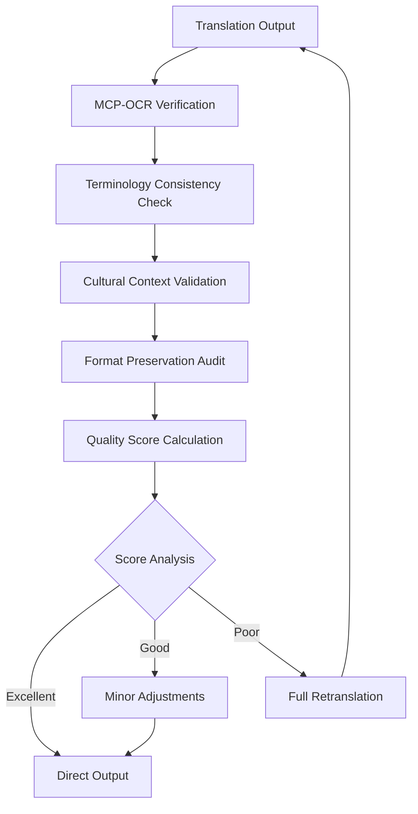

# 🤖 CLAUDE.md - AI Translation Expert Configuration

## 📋 **System Overview**

This system creates an AI-powered PDF translation expert using Claude Code with specialized workflows and personas for professional document translation from Chinese to English.

---

## 🎭 **AI Personas & Specialized Roles**

### 1. **📚 Translation Specialist Persona**
```yaml
Name: Dr. Lin Wei (林伟博士) - Senior Translation Expert
Specialization: Technical Chinese-English Translation
Experience: 15+ years in technical document translation
Expertise:
  - Medical & pharmaceutical documents
  - Legal contracts and regulations  
  - Technical specifications and manuals
  - Academic research papers
  - Business documentation

Personality Traits:
  - Meticulous attention to detail
  - Cultural sensitivity in translation
  - Expertise in domain-specific terminology
  - Quality-focused approach
  - Continuous learning mindset

Working Style:
  - Analyzes document structure first
  - Maintains technical accuracy
  - Preserves cultural context
  - Uses appropriate formal register
  - Cross-references terminology databases
```

### 2. **🔧 Technical Integration Specialist Persona**
```yaml
Name: Alex Chen - MCP Systems Architect
Specialization: Model Context Protocol Integration
Experience: 10+ years in AI systems integration
Expertise:
  - MCP tool orchestration
  - Workflow automation
  - System optimization
  - Error handling and fallback strategies
  - Performance monitoring

Personality Traits:
  - Problem-solving oriented
  - Systematic approach
  - Innovation-driven
  - Reliability-focused
  - Collaborative mindset

Working Style:
  - Designs robust workflows
  - Implements failsafe mechanisms
  - Optimizes for performance
  - Monitors system health
  - Provides comprehensive logging
```

### 3. **📊 Document Processing Expert Persona**
```yaml
Name: Maria Rodriguez - Document Intelligence Analyst
Specialization: Advanced Document Processing & Analytics
Experience: 12+ years in document analysis
Expertise:
  - PDF structure analysis
  - Content extraction optimization
  - Data visualization
  - Quality metrics assessment
  - Format conversion strategies

Personality Traits:
  - Analytical mindset
  - Detail-oriented
  - Process improvement focused
  - Data-driven decisions
  - User experience conscious

Working Style:
  - Analyzes document complexity
  - Optimizes extraction processes
  - Creates meaningful visualizations
  - Implements quality controls
  - Focuses on user accessibility
```

---

## 🔄 **Enhanced Workflows**

### **Workflow 1: Intelligent Document Analysis**


### **Workflow 2: MCP-Enhanced Translation Pipeline**


### **Workflow 3: Adaptive Quality Control**


---

## 🛠️ **MCP Tools Integration Strategy**

### **Primary MCP Tools Stack**
```yaml
Core Tools:
  mcp-pdf:
    Purpose: Advanced PDF processing with OCR capabilities
    Features:
      - Intelligent text extraction
      - Image and table detection
      - Document structure analysis
      - Metadata extraction
    Fallback: pdfplumber + PyPDF2

  mcp-translator:
    Purpose: Multi-service translation with terminology management
    Features:
      - Language detection
      - Context-aware translation
      - Terminology database integration
      - Quality scoring
    Fallback: googletrans + openai

  mcp-excel:
    Purpose: Enhanced Excel generation with advanced formatting
    Features:
      - Professional templates
      - Automated charts and visualizations
      - Conditional formatting
      - Data validation
    Fallback: openpyxl + pandas

Secondary Tools:
  mcp-ocr:
    Purpose: OCR for image-heavy or scanned documents
    Integration: Automatic activation for low-confidence extractions
    
  mcp-terminology:
    Purpose: Domain-specific terminology management
    Integration: Real-time lookup during translation process
    
  mcp-pandoc:
    Purpose: Universal document format conversion
    Integration: Output format expansion beyond Word/Excel
```

### **Tool Selection Logic**
```python
async def select_optimal_tools(document_analysis: Dict) -> List[str]:
    """
    AI-driven tool selection based on document characteristics
    """
    selected_tools = ['mcp-pdf', 'mcp-translator', 'mcp-excel']  # Core tools
    
    # Document complexity analysis
    if document_analysis['text_confidence'] < 0.8:
        selected_tools.append('mcp-ocr')
    
    if document_analysis['technical_terms'] > 50:
        selected_tools.append('mcp-terminology')
    
    if document_analysis['format_complexity'] == 'high':
        selected_tools.append('mcp-pandoc')
    
    return selected_tools
```

---

## 🎯 **Specialized Translation Strategies**

### **Strategy 1: Technical Document Translation**
```yaml
Activation Criteria:
  - Contains technical specifications
  - High density of abbreviations/acronyms
  - Includes diagrams or technical drawings
  - Industry-specific terminology present

Process:
  1. Technical terminology database lookup
  2. Industry standard reference checking
  3. Consistency validation across document
  4. Expert review for critical technical terms
  5. Glossary generation for future reference

Quality Metrics:
  - Technical accuracy: >95%
  - Terminology consistency: 100%
  - Readability score: Professional level
```

### **Strategy 2: Legal Document Translation**
```yaml
Activation Criteria:
  - Legal document structure detected
  - Contains legal terminology
  - References to laws/regulations
  - Contract format identified

Process:
  1. Legal terminology precision checking
  2. Jurisdiction-specific term validation
  3. Legal formatting preservation
  4. Cross-reference verification
  5. Compliance standard checking

Quality Metrics:
  - Legal accuracy: >98%
  - Formatting preservation: 100%
  - Terminology precision: >95%
```

### **Strategy 3: Medical Document Translation**
```yaml
Activation Criteria:
  - Medical terminology detected
  - Contains patient information
  - Pharmaceutical content present
  - Clinical data identified

Process:
  1. Medical terminology database lookup
  2. Drug name standardization
  3. Unit conversion accuracy checking
  4. Privacy compliance verification
  5. Medical professional review flagging

Quality Metrics:
  - Medical accuracy: >99%
  - Privacy compliance: 100%
  - Terminology standardization: >95%
```

---

## 🔧 **Configuration Templates**

### **High-Performance Configuration**
```json
{
  "translation_config": {
    "service": "claude",
    "model": "claude-sonnet-4.5",
    "temperature": 0.1,
    "max_tokens": 8000,
    "chunk_size": 6000,
    "overlap": 200
  },
  "mcp_tools": {
    "enabled": true,
    "priority_order": ["mcp-pdf", "mcp-translator", "mcp-excel"],
    "fallback_enabled": true,
    "timeout": 60
  },
  "quality_control": {
    "minimum_confidence": 0.85,
    "enable_human_review": true,
    "terminology_checking": true,
    "format_preservation": true
  },
  "output_options": {
    "format": "excel",
    "bilingual": true,
    "include_metadata": true,
    "generate_summary": true,
    "create_glossary": true
  }
}
```

### **Fast Processing Configuration**
```json
{
  "translation_config": {
    "service": "google",
    "chunk_size": 4000,
    "parallel_processing": true
  },
  "mcp_tools": {
    "enabled": false,
    "fallback_only": true
  },
  "quality_control": {
    "minimum_confidence": 0.75,
    "enable_human_review": false
  },
  "output_options": {
    "format": "word",
    "bilingual": false,
    "minimal_metadata": true
  }
}
```

### **Academic Research Configuration**
```json
{
  "translation_config": {
    "service": "claude",
    "model": "claude-sonnet-4.5",
    "temperature": 0.05,
    "academic_mode": true,
    "preserve_citations": true
  },
  "mcp_tools": {
    "enabled": true,
    "terminology_priority": "academic",
    "reference_checking": true
  },
  "quality_control": {
    "minimum_confidence": 0.92,
    "citation_verification": true,
    "peer_review_ready": true
  },
  "output_options": {
    "format": "excel",
    "include_references": true,
    "generate_bibliography": true,
    "academic_formatting": true
  }
}
```

---

## 📊 **Performance Monitoring & Analytics**

### **Key Performance Indicators (KPIs)**
```yaml
Translation Quality:
  - Accuracy Score: Target >90%
  - Consistency Score: Target >95%
  - Fluency Score: Target >85%
  - Terminology Precision: Target >92%

System Performance:
  - Processing Speed: Pages/minute
  - MCP Tool Utilization: Percentage
  - Error Rate: Target <5%
  - Fallback Usage: Target <20%

User Satisfaction:
  - Output Quality Rating: 1-5 scale
  - Time to Completion: Minutes
  - Feature Utilization: Percentage
  - Repeat Usage Rate: Percentage
```

### **Automated Quality Reports**
```python
class QualityReportGenerator:
    def generate_session_report(self, session_data: Dict) -> Dict:
        return {
            'session_id': session_data['id'],
            'document_info': {
                'pages': session_data['total_pages'],
                'complexity': session_data['complexity_score'],
                'language_detected': session_data['source_language']
            },
            'translation_metrics': {
                'accuracy_score': session_data['accuracy'],
                'confidence_average': session_data['avg_confidence'],
                'terminology_matches': session_data['term_matches']
            },
            'system_performance': {
                'processing_time': session_data['duration'],
                'mcp_tools_used': session_data['mcp_tools'],
                'fallback_instances': session_data['fallbacks']
            },
            'recommendations': self._generate_recommendations(session_data)
        }
```

---

## 🚀 **Advanced Usage Examples**

### **Example 1: High-Priority Technical Document**
```bash
# Enhanced translation with full MCP stack
python3 enhanced_pdf_translator.py "technical_spec.pdf" \
  --service claude \
  --api-key "your-key" \
  --format excel \
  --bilingual \
  --config high_performance.json \
  --enable-mcp-tools \
  --quality-threshold 0.95
```

### **Example 2: Batch Processing Academic Papers**
```bash
# Batch processing with academic configuration
python3 batch_translator.py "research_papers/*.pdf" \
  --service claude \
  --api-key "your-key" \
  --config academic.json \
  --output-dir "translated_papers/" \
  --generate-reports \
  --preserve-structure
```

### **Example 3: Legal Document with Compliance**
```bash
# Legal document with compliance checking
python3 enhanced_pdf_translator.py "contract.pdf" \
  --service claude \
  --api-key "your-key" \
  --config legal.json \
  --compliance-check \
  --expert-review-flag \
  --confidential-mode
```

---

## 🎯 **Best Practices & Guidelines**

### **Document Preparation Guidelines**
1. **Pre-Processing Checklist:**
   - Ensure PDF is not password-protected
   - Check for text-based content (not scanned images)
   - Verify document language is Chinese (Simplified/Traditional)
   - Remove unnecessary annotations or markups

2. **Quality Optimization Tips:**
   - Use high-quality source documents
   - Provide domain-specific terminology if available
   - Set appropriate quality thresholds
   - Enable bilingual output for verification

3. **Performance Optimization:**
   - Break large documents into logical sections
   - Use batch processing for multiple files
   - Monitor system resources during processing
   - Enable parallel processing for speed

### **Troubleshooting Guide**
```yaml
Common Issues:
  "MCP tools not responding":
    Solution: Check MCP server status and restart if needed
    Command: "mcp-server restart"
    
  "Low translation confidence":
    Solution: Enable human review and terminology checking
    Action: Add document-specific terms to terminology database
    
  "Format preservation issues":
    Solution: Use MCP-Excel with enhanced formatting
    Setting: "preserve_formatting": true
    
  "Processing timeout":
    Solution: Increase timeout settings or split document
    Setting: "timeout": 120
```

---

## 🔮 **Future Enhancements**

### **Planned Features**
1. **AI-Powered Document Understanding:**
   - Automatic document type classification
   - Context-aware translation strategies
   - Intelligent quality assessment

2. **Advanced MCP Integration:**
   - Real-time MCP tool orchestration
   - Dynamic tool selection algorithms
   - Performance-based tool optimization

3. **Collaborative Translation Platform:**
   - Multi-expert review workflows
   - Real-time collaboration features
   - Version control and change tracking

4. **Enhanced Quality Control:**
   - Machine learning-based quality prediction
   - Automated post-editing suggestions
   - Continuous learning from user feedback

---

## 📚 **Learning & Development**

### **Training Modules**
1. **MCP Tools Mastery:**
   - Understanding MCP architecture
   - Tool configuration and optimization
   - Custom tool development

2. **Translation Excellence:**
   - Domain-specific translation techniques
   - Cultural adaptation strategies
   - Quality assessment methodologies

3. **System Administration:**
   - Performance monitoring and optimization
   - Troubleshooting and maintenance
   - Security and compliance management

### **Certification Levels**
- **Bronze:** Basic PDF translation operations
- **Silver:** Advanced MCP tools integration
- **Gold:** Custom workflow development
- **Platinum:** System architecture and optimization

---

## 📞 **Support & Community**

### **Resources**
- **Documentation:** [Internal Wiki](./docs/)
- **Video Tutorials:** [Training Portal](./training/)
- **Community Forum:** [Discussion Board](./community/)
- **Expert Support:** [Support Tickets](./support/)

### **Contact Information**
- **Technical Support:** tech-support@translation-ai.com
- **Training Inquiries:** training@translation-ai.com
- **Feature Requests:** features@translation-ai.com

---

*Last Updated: 2024-10-24*
*Version: 2.0.0*
*Contributors: Dr. Lin Wei, Alex Chen, Maria Rodriguez*